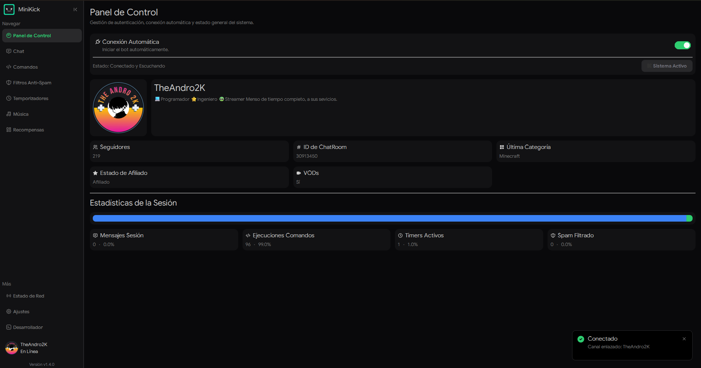
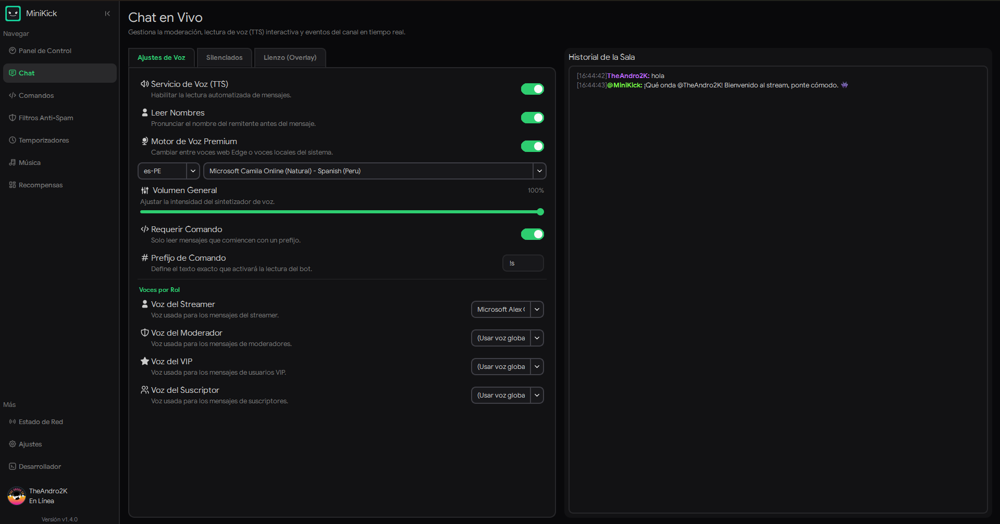
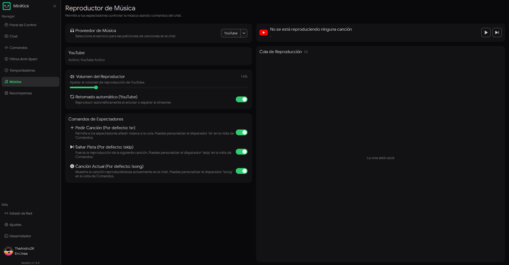
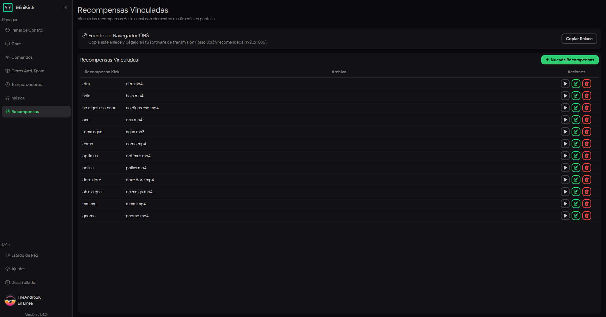

# MiniKick

**El centro de control definitivo, modular y ligero para streamers en Kick.com**

[](https://github.com/Andro2k/MiniKick/releases/latest) [](https://github.com/Andro2k/MiniKick/releases/latest) [](https://www.python.org/) [](https://doc.qt.io/qtforpython-6/) [](./#arquitectura-e-ingenieria) [](https://github.com/Andro2k/MiniKick/blob/main/LICENSE/README.md)

<br>

MiniKick es una aplicación de escritorio nativa diseñada para orquestar la interacción en directo sin sacrificar los FPS de tu transmisión. Operando por completo fuera del navegador, reduce drásticamente el consumo de memoria RAM y ciclos de CPU, integrando lectura de chat inteligente por voz (TTS), moderación automatizada, control multimedia en tiempo real y un potente sistema de overlays personalizables para OBS.

<br>

[](https://github.com/Andro2k/MiniKick/releases/latest)

---

### Vista Previa de la Interfaz









---

### Funcionalidades Principales

| Módulo                     | Función                     | Descripción                                                                                                                                                      |
| :------------------------- | :-------------------------- | :--------------------------------------------------------------------------------------------------------------------------------------------------------------- |
| **Motor de Chat**          | Pipeline Unidireccional     | Procesamiento de mensajes mediante tubería de interceptores puros (_AutoMod -> Comandos -> UI -> TTS_) con visualización de comandos en el historial de sala.    |
| **Lienzo y Overlays**      | OBS Widgets                 | Generación local de overlays de chat de alto rendimiento con soporte de emotes Kick y 7TV, auto-ocultación, marcas de tiempo y redimensionamiento dinámico.      |
| **Voz Híbrida (TTS)**      | Narración Inteligente       | Voces personalizadas por roles (Streamer, Moderador, VIP, Suscriptor). Alternancia dinámica entre voces de Microsoft Edge-TTS y SAPI5 local.                     |
| **Integración de Música**  | Control de Puntos           | Soporte de Spotify y YouTube Music. Canje de canciones (`!sr`), saltos (`!skip`) y consulta de pista (`!song`) con portadas dinámicas y progreso en tiempo real. |
| **AutoMod Integrado**      | Filtros Anti-Spam           | Protección activa contra exceso de mayúsculas, símbolos, repeticiones, enlaces y párrafos masivos con bloqueo visual de controles en caso de fallos.             |
| **Diagnóstico y Reportes** | Herramientas de Estabilidad | Captura global de excepciones con reporte de crashes automatizado a webhooks de Discord y separador de lógica visual en informes de bugs.                        |

> [!NOTE]
> Todas las preferencias de usuario, bases de datos locales (`SQLite`) y tokens cifrados de sesión persisten de forma aislada en el directorio nativo del sistema: `AppData\Local\.Minikick`.

---

### Arquitectura e Ingeniería

MiniKick está construido bajo estándares estrictos de **Ingeniería de Software a Escala**. Para garantizar latencias inferiores a un milisegundo y cero fugas de memoria durante streams de más de 12 horas, el código respeta los siguientes principios:

1. **Lazy Loading (Carga Perezosa):** Los controladores y servicios pesados (asistentes de configuración, workers de descarga e interfaces secundarias) se importan bajo demanda. Esto reduce el consumo inicial y acelera el tiempo de arranque de la aplicación.
2. **Eficiencia Algorítmica Big-O ($O(1)$):** Erradicación de bucles anidados en rutas críticas. Las validaciones de usuarios ignorados utilizan tablas hash `Set()` nativas, y los analizadores de texto reemplazan condicionales masivas por tablas de despacho estáticas.
3. **Patrón Pipeline (Chain of Responsibility):** Desacoplamiento del flujo del chat. Cada mensaje entrante es un objeto de transferencia de datos (`DTO`) que atraviesa transformaciones puras e independientes.
4. **Gestión Segura de Memoria C++/Qt:** Prevención de hilos huérfanos. Todos los procesos asíncronos y trabajadores temporales aplican liberación determinista mediante la señal `.finished.connect(deleteLater)`.
5. **Inversión de Dependencias y SoR:** Separación estricta entre capas de Red (_Providers_), Lógica de Dominio (_Services_) y Presentación Pasiva (_Views/PySide6_).

> [!IMPORTANT]
> **Normativa de Contribución:** Cualquier propuesta de cambio para el proyecto debe pasar auditoría de complejidad temporal y respetar el desacoplamiento de capas para ser integrada en la rama principal.

---

### Stack Tecnológico

- **Core & GUI:** Python 3.10+ | PySide6 (Qt for Python) | Qt Style Sheets (QSS contextual)
- **Servicios de Red:** HTTP Server Local | WebSockets | Requests | Cloudscraper (Bypass de Cloudflare)
- **Motores de Voz:** Edge-TTS (Edge Cloud) | Pyttsx3 (SAPI5 local de Windows)
- **Motores de Audio:** YT-DLP (YouTube resolve) | Spotify Web API
- **Base de Datos y Almacenamiento:** SQLite3 | JSON File Storage
- **Compilación y Empaquetado:** PyInstaller | Inno Setup

---

### Guía de Despliegue

#### Entorno de Producción (Creadores)

1. Dirígete a la página de [Releases Oficiales](https://github.com/Andro2k/MiniKick/releases/latest).
2. Descarga el instalador ejecutable (`MiniKick_Installer.exe`).
3. Ejecuta el asistente nativo en tu ordenador Windows 10/11.

#### Entorno de Desarrollo (Ingenieros)

Configuración del entorno local para experimentación y desarrollo:

```bash
# 1. Clonar el repositorio
git clone https://github.com/Andro2k/MiniKick.git
cd MiniKick

# 2. Crear y activar entorno virtual
python -m venv .venv
.\.venv\Scripts\activate

# 3. Instalar dependencias de desarrollo
pip install -r requirements.txt

# 4. Iniciar aplicación con recolector de logs
python main.py
```

> [!TIP]
> Si experimentas algún comportamiento inesperado de red o cierre abrupto, revisa la pestaña interna **Developer -> Logs** de la aplicación o consulta el diálogo de reporte de fallos automatizado antes de abrir un ticket de soporte.

<sub>Diseñado y desarrollado con estándares de arquitectura por</sub> [<sub>**TheAndro2K**</sub>](https://github.com/Andro2k) <sub>Distribuido bajo la Licencia MIT</sub>
