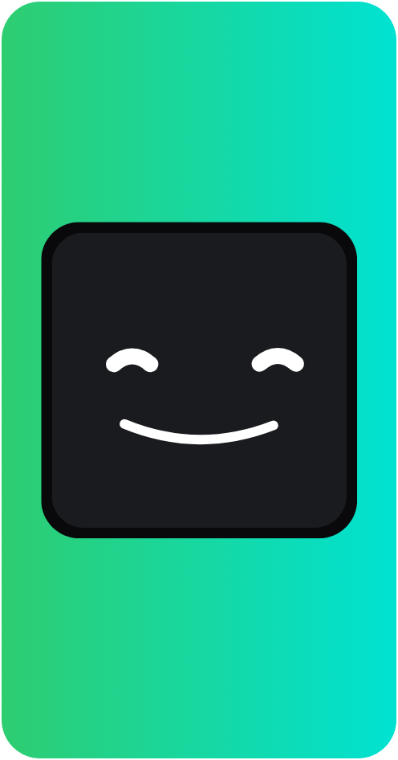

<div align="left">
  <p><strong>MiniKick</strong></p>
  <p>El centro de control definitivo para streamers en Kick.com</strong>
    <strong>MiniKick</strong> es una aplicación de escritorio nativa diseñada para optimizar la interacción en Kick.com. Actualmente, el proyecto se centra en ofrecer un sistema de lectura de chat avanzado y personalizable, operando completamente fuera del navegador para reducir drásticamente el consumo de recursos de tu PC mientras transmites.
  </p>

  <br>

  <p>
    <a href="https://github.com/Andro2k/MiniKick/releases/latest">
      
    </a>
    
  </p>
  <p>
    
    
  </p>
  <p>
    
    
  </p>
  
  <a href="https://github.com/Andro2k/MiniKick/releases/latest">
    
  </a>
</div>

<br clear="both" />

---

## ✨ Funcionalidades

| Módulo | Función | Implementación |
| :--- | :--- | :--- |
| **Lectura de Chat** | TTS con IA Web | Narración de alta fidelidad con voces naturales mediante `edge-tts`. |
| **Lectura de Chat** | TTS Local | Motor de voz sintetizada sin dependencia de internet a través de `pyttsx3`. |
| **Conectividad** | Tiempo Real | Integración directa e instantánea con los eventos de Kick mediante WebSockets. |
| **Sistema OTA** | Actualizaciones | Búsqueda, descarga e instalación de nuevas versiones en segundo plano. |

---

## 🛠️ Stack Tecnológico

| Categoría | Tecnologías | Propósito |
| :--- | :--- | :--- |
| **Interfaz Gráfica** |  | Desarrollo de la UI moderna, minimalista y gestión de ventanas. |
| **Voz y Audio** |    | Motores de síntesis de voz, renderizado asíncrono y reproducción de audio en hilos dedicados. |
| **Conexión** |   | Gestión de sockets en tiempo real y peticiones HTTP con bypass de seguridad (Cloudscraper). |
| **Entorno** |   | Programación asíncrona concurrente y gestión segura de variables de entorno. |
| **Distribución** |  | Compilación y empaquetado para despliegue en sistemas Windows. |

---

## 🏗️ Arquitectura y Buenas Prácticas

El núcleo de MiniKick está diseñado para ser altamente escalable. El desarrollo se rige estrictamente por estas 5 reglas de arquitectura para garantizar la mantenibilidad:

1. **Dependency Inversion:** Uso intensivo de interfaces (ej. `ITTSProvider`) para desacoplar la lógica de negocio de las implementaciones concretas.
2. **Separation of Responsibilities (SoR):** Capas claramente delimitadas. Las Vistas son pasivas, los Workers manejan la carga pesada, y los Controladores orquestan.
3. **High Cohesion:** Cada clase y módulo tiene un propósito único y bien definido (ej. el manejo aislado del motor de audio).
4. **DRY (Don't Repeat Yourself):** Centralización de lógica repetitiva priorizando siempre la legibilidad del código.
5. **YAGNI (You Aren't Gonna Need It):** Abstracciones justificadas. Resolvemos problemas reales de forma simple sin caer en la sobre-ingeniería.

---

## ⚙️ Instalación

### Entorno de Producción (Usuarios)
La forma más sencilla de usar MiniKick:
1. Navega a la sección de [Releases](https://github.com/Andro2k/MiniKick/releases/latest).
2. Descarga el ejecutable más reciente.
3. Ejecuta el instalador en tu máquina Windows.

### Entorno de Desarrollo (Contribuidores)
Si deseas explorar el código fuente o contribuir al proyecto:
```bash
# Clonar el repositorio
git clone [https://github.com/Andro2k/MiniKick.git](https://github.com/Andro2k/MiniKick.git)
cd MiniKick

# Crear y activar entorno virtual
python -m venv venv
venv\Scripts\activate  # En Windows

# Instalar dependencias
pip install -r requirements.txt

# Ejecutar la aplicación
python main.py
```

---

## Licencia

Este proyecto se distribuye bajo la Licencia MIT. Consulte el archivo LICENSE para mas detalles.

<div align="center">
  <br>
  <sub>Desarrollado por <strong>TheAndro2K</strong></sub>
</div>

