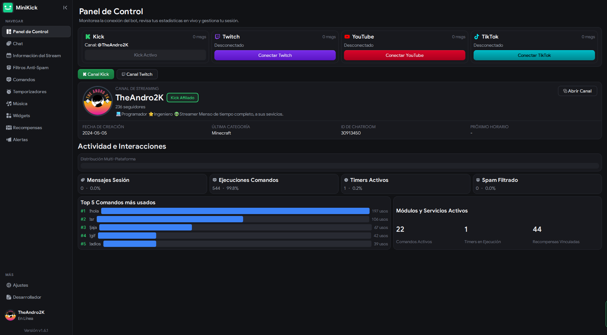
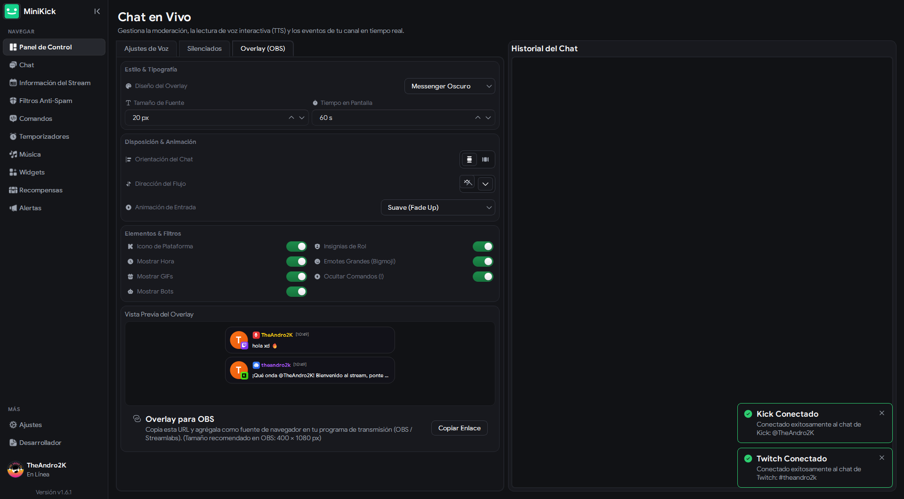
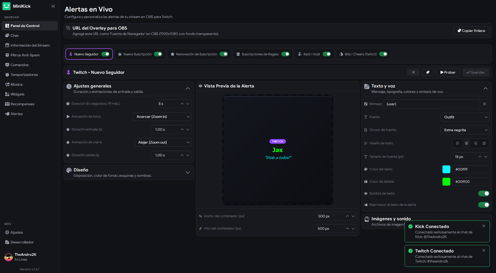
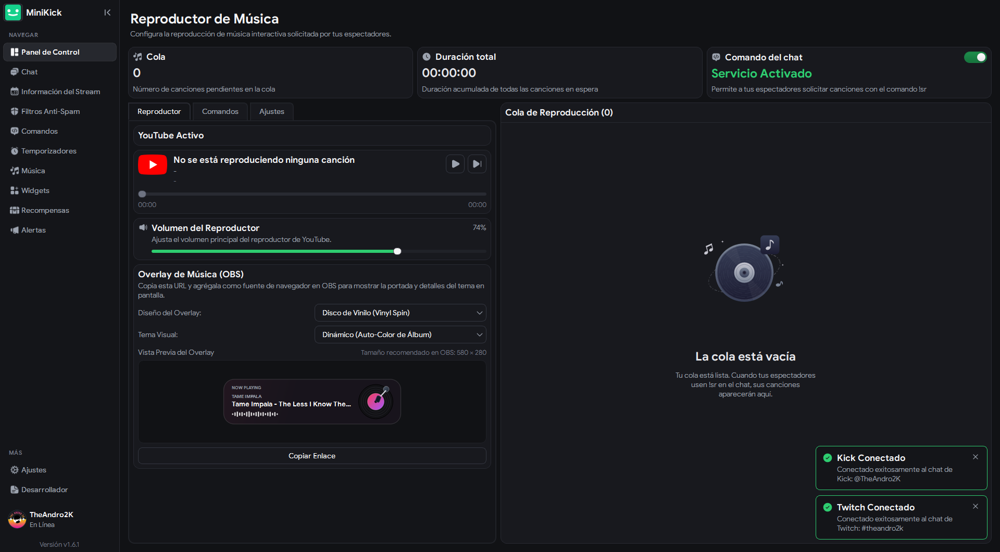
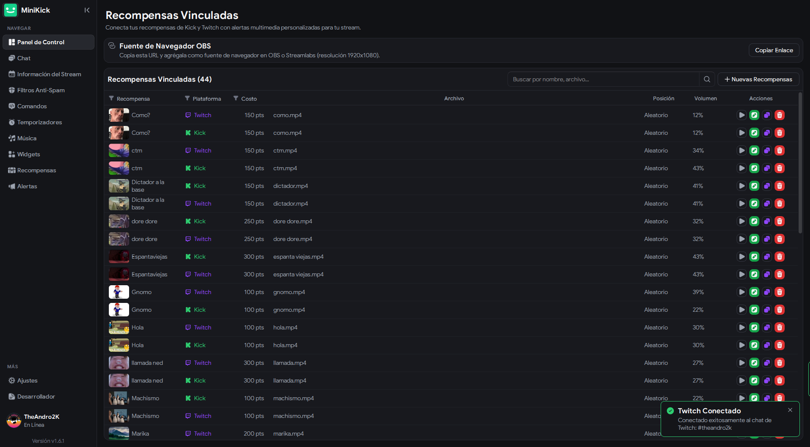
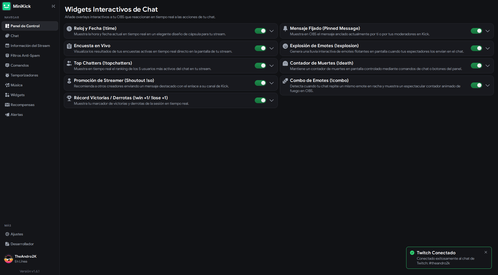
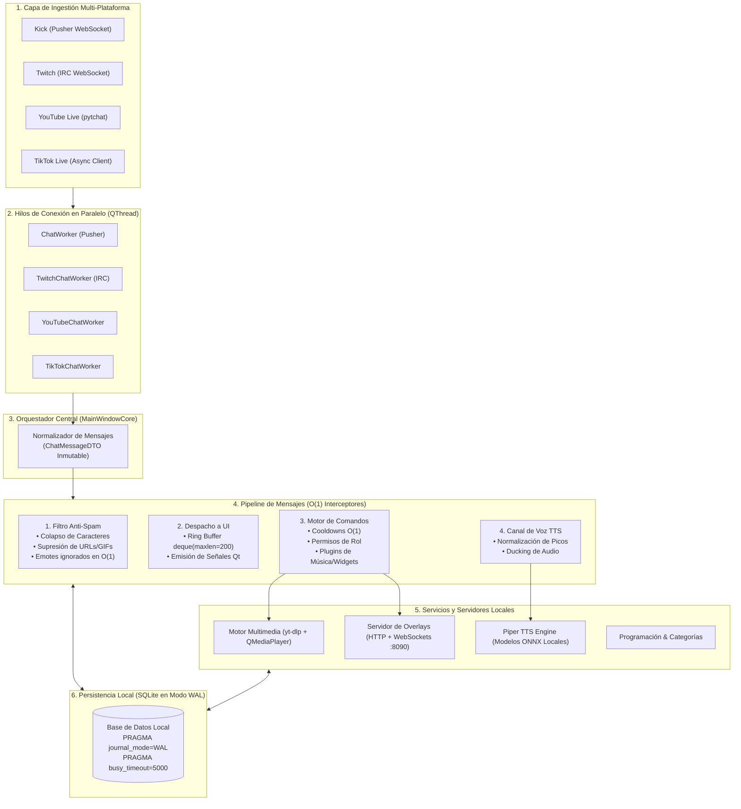

# MiniKick

**El centro de control definitivo, modular y ultra ligero para streamers en Kick, Twitch, YouTube y TikTok**

[](https://github.com/Andro2k/MiniKick/releases/latest) [](https://github.com/Andro2k/MiniKick/releases/latest) [](https://www.python.org/) [](https://doc.qt.io/qtforpython-6/) [](#arquitectura-e-ingenier%C3%ADa) [](LICENSE)

<br>

MiniKick es una aplicación de escritorio nativa concebida para gestionar y potenciar transmisiones en vivo sin sacrificar los FPS de tus juegos ni saturar la memoria RAM. Al operar de forma 100% independiente del navegador web, reduce drásticamente el consumo de CPU y memoria, unificando en tiempo real la interacción simultánea de **Kick**, **Twitch**, **YouTube Live** y **TikTok Live**.

Cuenta con síntesis de voz neuronal local de ultra baja latencia (**Piper TTS**), reproducción interactiva de música, alertas granulares cross-platform, filtros anti-spam inteligentes, moderación automatizada y un completo servidor local de overlays para OBS Studio.

<br>

[](https://github.com/Andro2k/MiniKick/releases/latest)

---

## Vista Previa de la Interfaz

### Panel de Control Multi-Plataforma
Monitoreo en vivo de conexiones, estadísticas en tiempo real, canales enlazados y métricas clave de la sesión de transmisión.


### Overlay de Chat en Vivo para OBS
Nuevo diseño estilo mensajería con avatares de usuario, insignias de plataforma, soporte para animaciones GIF, perfiles duales (Vertical y Horizontal) y sincronización instantánea (Live Sync).


### Suite Granular de Alertas
Personalización visual completa con 14 animaciones independientes de entrada y salida, tipografía de alta fidelidad, previsualización 1:1 y duplicación cross-platform con un clic.


### Reproductor Multimedia Inteligente
Cola interactiva de canciones solicitadas por espectadores (`!sr`), barra de progreso deslizable (scrubber), atenuación automática de volumen durante lectura de voz (Ducking) y curva acústica perceptual.


### Recompensas de Canal Vinculadas
Gestión y duplicación instantánea de recompensas de puntos entre Kick y Twitch con soporte para nombres idénticos, ordenamiento alfabético y alertas personalizadas.


### Widgets Interactivos de OBS
Colección de overlays dinámicos para pantalla: Top Chatters con avatares, Reloj/Fecha, Encuestas con resolución de empates, Contador de muertes y Marcador de victorias/derrotas.


---

## Funcionalidades Principales

| Módulo | Característica | Beneficio para el Streamer |
| :--- | :--- | :--- |
| **Ingestión 4-en-1** | Kick + Twitch + YouTube + TikTok | Conexión simultánea a múltiples plataformas en hilos independientes sin necesidad de ventanas de navegador abiertas ni resolución manual de captchas. |
| **Overlay de Chat para OBS** | Estilo Messenger con Avatares | Burbujas modernas con avatar circular, insignia de Kick/Twitch, soporte de GIFs (`!gif`), emotes animados y 3 temas visuales (Oscuro, Claro Frosted Glass y Minimalista). |
| **Perfiles Duales de Chat** | Vertical & Horizontal | Configuración totalmente independiente de tipografía, tamaño y márgenes para emisiones estándar (16:9) y contenido vertical (TikTok, Reels, Shorts). |
| **Voz Neuronal Local (TTS)** | Piper TTS ONNX en CPU | Síntesis de voz ultra rápida en CPU (~19x velocidad real) con catálogo integrado de más de 30 voces comunitarias en español, inglés y más idiomas. |
| **Protección Acústica** | Ducking & Normalización | La música baja de volumen automáticamente mientras el bot lee un mensaje y se restaura al terminar. Las voces de bajo volumen se normalizan para sonar claras y uniformes. |
| **Filtro Anti-Spam Inteligente** | Colapso de Caracteres & URLs | Detección y compresión automática de letras o palabras repetitivas y supresión de enlaces web para evitar interrupciones molestas en el directo. |
| **Alertas & Recompensas** | Duplicación Cross-Platform | Clonación inmediata de configuraciones visuales, audios y animaciones entre Kick y Twitch con un solo clic. |
| **Música Interactiva** | Scrubber & Peticiones (`!sr`) | Búsqueda y resolución de canciones por YouTube (`yt-dlp`), reordenamiento de cola por arrastre y salto interactivo en la barra de tiempo. |
| **Widgets de OBS** | Overlays en Tiempo Real | Reconocimiento en pantalla a espectadores activos (Top Chatters), encuestas con visualización de resultados y contadores interactivos. |
| **Resiliencia & Persistencia** | SQLite WAL & Autostart | Almacenamiento local seguro, inicio automático con Windows, control rápido desde la bandeja del sistema y reconexión inmediata ante caídas de red. |

> [!NOTE]
> Todas las preferencias de usuario, bases de datos locales (`SQLite`), modelos neuronales descargados y tokens de sesión persisten de forma aislada y segura en el directorio nativo del sistema: `%LOCALAPPDATA%\.Minikick`.

---

## Comandos de Chat Disponibles

MiniKick incluye un conjunto de comandos listos para usar en el chat de transmisión tanto para streamers y moderadores como para espectadores:

| Comando | Permiso | Descripción |
|---|---|---|
| `!sr <búsqueda / URL>` | Todos | Solicita una canción de YouTube para agregar a la cola de reproducción. |
| `!skip` | Moderador / Streamer | Salta la canción actual en reproducción. |
| `!gif <búsqueda>` | Todos | Busca y proyecta una animación GIF en el overlay de chat de OBS. |
| `!ttsmute <usuario>` | Moderador / Streamer | Silencia la lectura de voz para los mensajes de un espectador específico. |
| `!ttsblock <palabra>` | Moderador / Streamer | Añade una palabra o frase a la lista negra de filtros del bot. |
| `!topchatters` | Todos | Muestra el ranking en vivo de los espectadores con mayor interacción en el stream. |
| `!time` | Todos | Muestra la hora y fecha actual en el widget de OBS. |
| `!death` / `!death +1` | Moderador / Streamer | Consulta o incrementa el contador de muertes en pantalla. |
| `!win +1` / `!lose +1` | Moderador / Streamer | Incrementa el marcador de victorias o derrotas de la sesión. |
| `!so <usuario>` | Moderador / Streamer | Envía un mensaje destacado promocionando el canal de otro creador. |

---

## Arquitectura e Ingeniería

MiniKick está construido bajo principios de **Ingeniería de Software a Escala**, priorizando la **Separación de Responsabilidades (SoR)**, **Inversión de Dependencias (IoC)** y **Eficiencia Algorítmica Big-O**.


```mermaid
flowchart TD
    subgraph INGESTION["1. Capa de Ingestión Multi-Plataforma"]
        KICK["Kick (Pusher WebSocket)"]
        TWITCH["Twitch (IRC WebSocket)"]
        YT["YouTube Live (pytchat)"]
        TIKTOK["TikTok Live (Async Client)"]
    end

    subgraph WORKERS["2. Hilos de Conexión en Paralelo (QThread)"]
        K_WORK["ChatWorker (Pusher)"]
        T_WORK["TwitchChatWorker (IRC)"]
        Y_WORK["YouTubeChatWorker"]
        TK_WORK["TikTokChatWorker"]
    end

    subgraph CORE["3. Orquestador Central (MainWindowCore)"]
        DISPATCH["Normalizador de Mensajes\n(ChatMessageDTO Inmutable)"]
    end

    subgraph PIPELINE["4. Pipeline de Mensajes (O(1) Interceptores)"]
        P_SPAM["1. Filtro Anti-Spam\n• Colapso de Caracteres\n• Supresión de URLs/GIFs\n• Emotes ignorados en O(1)"]
        P_UI["2. Despacho a UI\n• Ring Buffer deque(maxlen=200)\n• Emisión de Señales Qt"]
        P_CMD["3. Motor de Comandos\n• Cooldowns O(1)\n• Permisos de Rol\n• Plugins de Música/Widgets"]
        P_TTS["4. Canal de Voz TTS\n• Normalización de Picos\n• Ducking de Audio"]
    end

    subgraph SERVICES["5. Servicios y Servidores Locales"]
        MUSIC["Motor Multimedia (yt-dlp + QMediaPlayer)"]
        TTS["Piper TTS Engine (Modelos ONNX Locales)"]
        OVERLAY["Servidor de Overlays (HTTP + WebSockets :8090)"]
        SCHED["Programación & Categorías"]
    end

    subgraph DATABASE["6. Persistencia Local (SQLite en Modo WAL)"]
        DB[("Base de Datos Local\nPRAGMA journal_mode=WAL\nPRAGMA busy_timeout=5000")]
    end

    INGESTION --> WORKERS
    WORKERS --> DISPATCH
    DISPATCH --> PIPELINE
    P_CMD --> MUSIC
    P_CMD --> OVERLAY
    P_TTS --> TTS
    PIPELINE <--> DATABASE
    SERVICES <--> DATABASE
```

### Principios Clave de Rendimiento:
1. **Eficiencia Algorítmica $\mathcal{O}(1)$**: Eliminación de bucles anidados en rutas críticas de chat y eventos. Historiales gestionados con `collections.deque` de tamaño fijo y búsquedas mediante tablas hash.
2. **Aceleración JSON en C/Rust (`msgspec` / `orjson`)**: Deserialización ultrarrápida con fallback transparente a la librería estándar, reduciendo el consumo de ciclos de procesador por mensaje.
3. **Carga Perezosa (Lazy Loading)**: Las vistas secundarias, diálogos pesados y modelos de voz se instancian bajo demanda o en precalentamiento diferido para un arranque en frío veloz.
4. **Concurrencia Segura**: Hilos aislados con `QThread` comunicados exclusivamente mediante el sistema de señales y ranuras de Qt (`Signals/Slots`), eliminando condiciones de carrera y bloqueos de interfaz.
5. **Base de Datos Resiliente**: SQLite configurado en modo `WAL` (*Write-Ahead Logging*) con reintentos automáticos y protección contra bloqueos concurrentes.

---

## Stack Tecnológico

- **Núcleo & Interfaz Gráfica:** Python 3.10+ | PySide6 (Qt 6) | Qt Style Sheets (QSS) con arquitectura de tokens centralizados.
- **Aceleración de Datos:** `msgspec` (C) | `orjson` (Rust).
- **Redes & Conectividad:** Servidor HTTP Local multihilo | WebSockets RFC 6455 nativo | Server-Sent Events (SSE) | Cloudscraper | Requests.
- **Síntesis de Voz (TTS):** Piper TTS (Modelos ONNX locales en CPU) | Edge-TTS (Nube) | SAPI5 (Windows nativo).
- **Audio & Multimedia:** YT-DLP | PySide6 QtMultimedia (`QMediaPlayer`, `QAudioOutput`) | Normalización acústica de amplitud.
- **Base de Datos:** SQLite3 (Modo transaccional WAL con transacciones ACID).
- **Gestor de Paquetes & Compilación:** `uv` | PyInstaller | Inno Setup.

---

## Guía de Instalación y Despliegue

### Para Creadores de Contenido (Streamers)

1. Dirígete a la sección de [Releases Oficiales en GitHub](https://github.com/Andro2k/MiniKick/releases/latest).
2. Descarga la versión más reciente (`MiniKick.exe` o el instalador del sistema).
3. Ejecuta el programa en Windows 10 u 11. No requiere instalar Python ni dependencias adicionales.

### Para Desarrolladores

Configuración del entorno de desarrollo local utilizando `uv`:

```bash
# 1. Clonar el repositorio
git clone https://github.com/Andro2k/MiniKick.git
cd MiniKick

# 2. Sincronizar el entorno virtual y dependencias
uv sync

# 3. Ejecutar la aplicación en modo desarrollo
uv run python main.py

# 4. Ejecutar la suite completa de pruebas (82 tests)
uv run pytest resources/tests

# 5. Ejecutar la auditoría maestra de calidad (11 herramientas)
uv run python resources/tools/system_health_audit.py --all

# 6. Compilar el ejecutable de producción
uv run pyinstaller --clean --noconfirm MiniKick.spec
```

> [!TIP]
> Si experimentas algún comportamiento inesperado de red o desconexión, consulta la vista interna **Desarrollador -> Logs** de la aplicación o revisa el archivo de registro en `%LOCALAPPDATA%\.Minikick\logs\minikick.log`.

<br>

---

<sub>Diseñado y desarrollado con dedicación por</sub> [<sub>**TheAndro2K**</sub>](https://github.com/Andro2k) <sub>• Distribuido bajo la Licencia MIT</sub>
