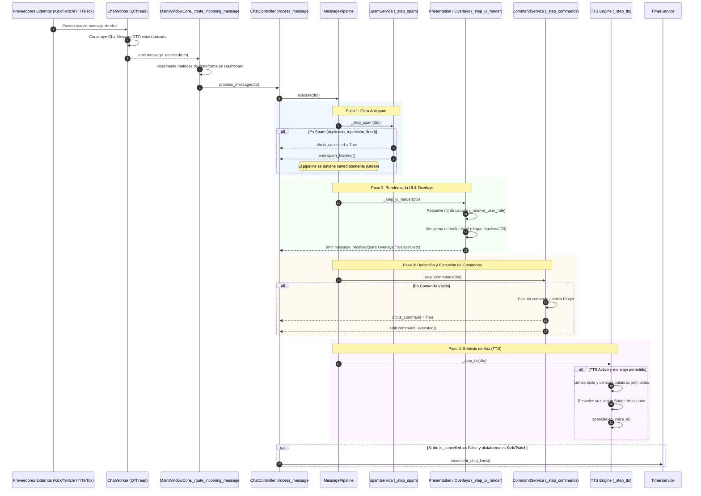
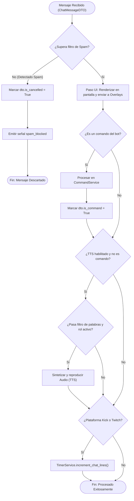
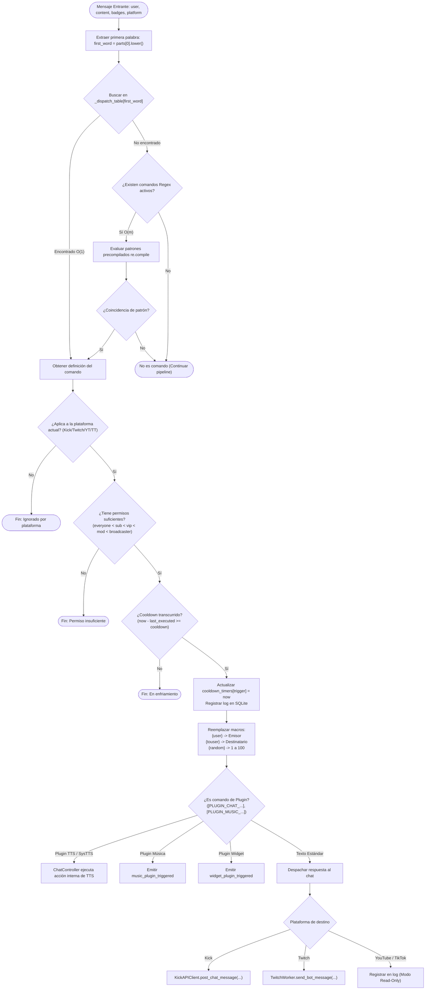
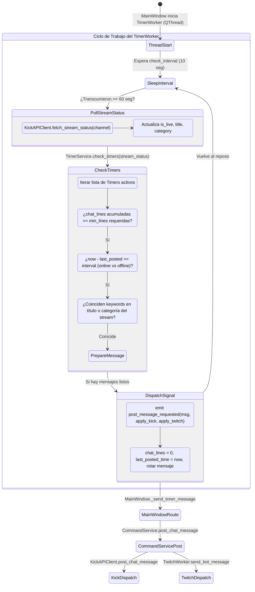
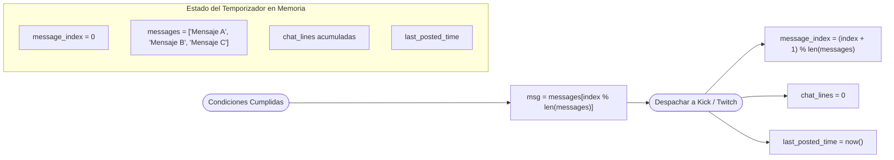
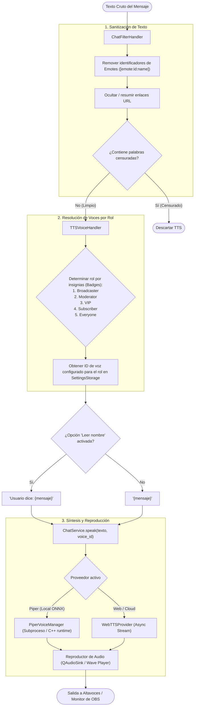

# Arquitectura Técnica y Diagramas del Backend — MiniKick

Este documento detalla la arquitectura de software, los flujos de ejecución, los patrones de diseño y la complejidad algorítmica del backend de **MiniKick**.

---

## Índice de Contenidos
1. [Visión General y Principios de Diseño](#1-visión-general-y-principios-de-diseño)
2. [Diagrama 1: Arquitectura Global en Capas](#2-diagrama-1-arquitectura-global-en-capas)
3. [Diagrama 2: Pipeline de Ingesta y Procesamiento de Chat](#3-diagrama-2-pipeline-de-ingesta-y-procesamiento-de-chat)
4. [Diagrama 3: Motor de Resolución y Ejecución de Comandos](#4-diagrama-3-motor-de-resolución-y-ejecución-de-comandos)
5. [Diagrama 4: Sistema Autónomo de Timers](#5-diagrama-4-sistema-autónomo-de-timers)
6. [Diagrama 5: Motor de Síntesis de Voz (TTS)](#6-diagrama-5-motor-de-síntesis-de-voz-tts)
7. [Matriz de Complejidad Algorítmica (Big-O)](#7-matriz-de-complejidad-algorítmica-big-o)
8. [Referencias de Código y Módulos](#8-referencias-de-código-y-módulos)

---

## 1. Visión General y Principios de Diseño

El backend de MiniKick está estructurado siguiendo los principios de **Clean Architecture** y **Separación Estricta de Responsabilidades (SoR)**:

* **Desacoplamiento Reactivo**: Comunicación entre capas mediante el sistema de **Señales y Slots de Qt (`PySide6`)**, garantizando que los servicios de negocio desconozcan la implementación gráfica de la interfaz.
* **Aislamiento de Concurrencia**: Tareas intensivas de red y polling se ejecutan en hilos dedicados ([`QThread`](file:///c:/Users/TheAn/Desktop/python/Kick/backend/workers/)), manteniendo el bucle principal de la interfaz gráfica a 60 FPS sin bloqueos.
* **Fronteras Externas Protegidas**: Los WebSockets y APIs de terceros (Kick, Twitch, YouTube, TikTok) se adaptan en la capa de proveedores y se normalizan en objetos de transferencia ([`ChatMessageDTO`](file:///c:/Users/TheAn/Desktop/python/Kick/backend/services/chat/pipeline.py)) antes de ingresar a la lógica de dominio.
* **Eficiencia Algorítmica**: Uso intensivo de tablas de despacho $\mathcal{O}(1)$ para resolución de comandos, conjuntos nativos (`set`) para filtrado de palabras/bots, y buffers acotados (`deque(maxlen=N)`).

---

## 2. Diagrama 1: Arquitectura Global en Capas

El sistema se divide en seis capas horizontales bien delimitadas:

```mermaid
graph TD
    subgraph Presentation_Layer ["1. Capa de Presentación (UI & Overlays)"]
        UI_Chat["ChatView / ChatWidget"]
        UI_Cmd["CommandsView / Wizard"]
        UI_Timers["TimersView / Dialogs"]
        UI_Dash["DashboardView / Stats"]
        Overlay_Server["OverlayServer (FastAPI / WebSocket)"]
    end

    subgraph Controller_Layer ["2. Capa de Controladores (Qt Signals / Slots)"]
        Ctrl_Chat["ChatController"]
        Ctrl_Cmd["CommandController"]
        Ctrl_Timer["TimerController"]
        Ctrl_Dash["DashboardController"]
    end

    subgraph Service_Layer ["3. Capa de Dominio y Servicios de Negocio"]
        Svc_Pipe["MessagePipeline"]
        Svc_Chat["ChatService"]
        Svc_Cmd["CommandService (Dispatch Table O(1))"]
        Svc_Timer["TimerService (Interval & Line Tracker)"]
        Svc_Spam["SpamService (Anti-Flood & Repetition)"]
        Svc_TTS["TTSService & PiperVoiceManager"]
    end

    subgraph Handler_Layer ["4. Handlers Especializados"]
        Hnd_Filter["ChatFilterHandler (Banned Words / Bots)"]
        Hnd_Voice["TTSVoiceHandler (Role Badge Resolver)"]
        Hnd_Music["MusicCommandHandler (Plugin Bridge)"]
    end

    subgraph Worker_Layer ["5. Capa de Hilos en Segundo Plano (QThread)"]
        Wrk_KickChat["KickChatWorker"]
        Wrk_TwitchChat["TwitchChatWorker"]
        Wrk_YTChat["YouTubeChatWorker"]
        Wrk_TTChat["TikTokChatWorker"]
        Wrk_Timers["TimerWorker (Interval Poller)"]
        Wrk_Schedule["ScheduleWorker"]
    end

    subgraph Boundary_Layer ["6. Proveedores Externos & Persistencia"]
        Ext_KickWS["Kick WebSocket (Pusher)"]
        Ext_TwitchWS["Twitch IRC WebSocket"]
        Ext_YT["YouTube Live Client"]
        Ext_TT["TikTok Live Client"]
        Ext_KickAPI["Kick API Client"]
        Ext_TwitchAPI["Twitch Helix API"]
        DB_Storage["SQLite Storage (Commands, Timers, Settings)"]
    end

    %% Presentation to Controller
    UI_Chat <--> Ctrl_Chat
    UI_Cmd <--> Ctrl_Cmd
    UI_Timers <--> Ctrl_Timer
    UI_Dash <--> Ctrl_Dash

    %% Controller to Services & Handlers
    Ctrl_Chat --> Svc_Pipe
    Ctrl_Chat --> Svc_Chat
    Ctrl_Chat --> Svc_Cmd
    Ctrl_Chat --> Svc_Spam
    Ctrl_Chat --> Hnd_Filter
    Ctrl_Chat --> Hnd_Voice
    Ctrl_Cmd --> Svc_Cmd
    Ctrl_Timer --> Svc_Timer

    %% Services Interconnections
    Svc_Pipe --> Svc_Spam
    Svc_Pipe --> Svc_Cmd
    Svc_Pipe --> Svc_Chat
    Svc_Chat --> Svc_TTS
    Svc_Cmd --> Ext_KickAPI

    %% Workers to Controllers and Services
    Wrk_KickChat -.->|message_received| Ctrl_Chat
    Wrk_TwitchChat -.->|message_received| Ctrl_Chat
    Wrk_YTChat -.->|message_received| Ctrl_Chat
    Wrk_TTChat -.->|message_received| Ctrl_Chat
    Wrk_Timers -.->|post_message_requested| Svc_Cmd

    %% Workers to External Providers
    Wrk_KickChat --- Ext_KickWS
    Wrk_TwitchChat --- Ext_TwitchWS
    Wrk_YTChat --- Ext_YT
    Wrk_TTChat --- Ext_TT
    Wrk_Timers --- Ext_KickAPI

    %% Persistence connections
    Svc_Cmd --- DB_Storage
    Svc_Timer --- DB_Storage
    Svc_Chat --- DB_Storage
```

---

## 3. Diagrama 2: Pipeline de Ingesta y Procesamiento de Chat

Cuando un mensaje arriba desde cualquiera de las cuatro plataformas soportadas, fluye de forma estandarizada a través de un [`MessagePipeline`](file:///c:/Users/TheAn/Desktop/python/Kick/backend/services/chat/pipeline.py) modular:

### Flujo Lógico de Decisión en el Pipeline

---

## 4. Diagrama 3: Motor de Resolución y Ejecución de Comandos

El componente [`CommandService`](file:///c:/Users/TheAn/Desktop/python/Kick/backend/services/chat/command_service.py) utiliza una tabla de despacho optimizada en memoria para resolver comandos en tiempo constante $\mathcal{O}(1)$:

---

## 5. Diagrama 4: Sistema Autónomo de Timers

El subsistema de temporizadores periódicos opera en un hilo separado ([`TimerWorker`](file:///c:/Users/TheAn/Desktop/python/Kick/backend/workers/timers_worker.py)), asegurando que los mensajes periódicos se envíen en función tanto del **tiempo transcurrido** como de la **actividad real del chat (líneas mínimas)**:

### Lógica de Rotación Round-Robin de Mensajes en Timers

---

## 6. Diagrama 5: Motor de Síntesis de Voz (TTS)

El flujo de audio desacopla la recepción del texto de la síntesis acústica, con soporte para proveedores locales (Piper TTS) y remotos (Web/Edge TTS):

---

## 7. Matriz de Complejidad Algorítmica (Big-O)

| Operación | Componente / Método | Complejidad Temporal | Complejidad Espacial | Justificación Técnica |
| :--- | :--- | :---: | :---: | :--- |
| **Lookup de Comandos Directos** | [`CommandService.process_incoming_message`](file:///c:/Users/TheAn/Desktop/python/Kick/backend/services/chat/command_service.py) | $\mathcal{O}(1)$ | $\mathcal{O}(C)$ | Tabla hash (`_dispatch_table`) con claves pre-normalizadas para triggers y alias. |
| **Búsqueda de Comandos Regex** | `CommandService._regex_commands` | $\mathcal{O}(m)$ | $\mathcal{O}(m)$ | $m$ es el número de comandos regex activos. Patrones precompilados mediante `re.compile`. |
| **Verificación de Cooldowns** | `CommandService._try_execute` | $\mathcal{O}(1)$ | $\mathcal{O}(C)$ | Búsqueda por clave en diccionario `cooldown_timers[trigger]` comparando timestamps Unix. |
| **Evaluación de Permisos** | `CommandService._has_permission` | $\mathcal{O}(B)$ | $\mathcal{O}(1)$ | $B$ es la cantidad de badges del usuario ($\le 5$). Comparación numérica jerárquica directa. |
| **Pipeline de Mensajes** | [`MessagePipeline.execute`](file:///c:/Users/TheAn/Desktop/python/Kick/backend/services/chat/pipeline.py) | $\mathcal{O}(k)$ | $\mathcal{O}(1)$ | $k$ middlewares secuenciales registrados (spam $\to$ ui $\to$ commands $\to$ tts). Detención temprana con `is_cancelled`. |
| **Filtro de Palabras Prohibidas** | [`ChatFilterHandler.is_message_banned`](file:///c:/Users/TheAn/Desktop/python/Kick/backend/handlers/chat_filter_handler.py) | $\mathcal{O}(W \cdot L)$ | $\mathcal{O}(W)$ | $W$ palabras censuradas contra longitud $L$ del mensaje. Uso de sets pre-hasheados. |
| **Chequeo de Timers Periódicos** | [`TimerService.check_timers`](file:///c:/Users/TheAn/Desktop/python/Kick/backend/services/chat/timer_service.py) | $\mathcal{O}(T)$ | $\mathcal{O}(T)$ | $T$ temporizadores activos. Evaluación unitaria de condiciones de línea y tiempo por ciclo. |
| **Incremento de Líneas de Chat** | `TimerService.increment_chat_lines` | $\mathcal{O}(T)$ | $\mathcal{O}(1)$ | Incremento directo de contadores enteros en el diccionario de seguimiento. |
| **Buffer de Historial de Chat** | `ChatController._message_buffer` | $\mathcal{O}(1)$ | $\mathcal{O}(M)$ | `collections.deque(maxlen=200)`. Inserción y desalojo de memoria en tiempo constante. |

*Donde $C$ = total de comandos, $m$ = comandos regex, $B$ = badges por usuario, $k$ = middlewares en pipeline, $W$ = palabras prohibidas, $L$ = longitud del mensaje, $T$ = temporizadores activos, $M$ = tamaño máximo del buffer de chat.*

---

## 8. Referencias de Código y Módulos

* **Controladores**:
  * [`ChatController`](file:///c:/Users/TheAn/Desktop/python/Kick/backend/controllers/chat_controller.py) — Orquestación del pipeline, eventos de chat, buffer UI y settings.
  * [`CommandController`](file:///c:/Users/TheAn/Desktop/python/Kick/backend/controllers/command_controller.py) — Interfaz de administración de comandos, wizards y validaciones.
  * [`TimerController`](file:///c:/Users/TheAn/Desktop/python/Kick/backend/controllers/timer_controller.py) — Gestión y configuración de temporizadores y búsqueda de categorías.
* **Servicios de Dominio**:
  * [`MessagePipeline`](file:///c:/Users/TheAn/Desktop/python/Kick/backend/services/chat/pipeline.py) — Ejecución desacoplada de middlewares de mensajería.
  * [`CommandService`](file:///c:/Users/TheAn/Desktop/python/Kick/backend/services/chat/command_service.py) — Motor de despacho de comandos, permisos, cooldowns y macros.
  * [`TimerService`](file:///c:/Users/TheAn/Desktop/python/Kick/backend/services/chat/timer_service.py) — Lógica de activación periódica por tiempo, líneas de chat y filtros.
  * [`ChatService`](file:///c:/Users/TheAn/Desktop/python/Kick/backend/services/chat/chat_service.py) — Configuración de audio, volumen, velocidad y providers de voz.
* **Workers Concurrentes**:
  * [`TimerWorker`](file:///c:/Users/TheAn/Desktop/python/Kick/backend/workers/timers_worker.py) — Hilo asíncrono para sondeo de estado de stream y disparo de timers.
  * [`KickChatWorker`](file:///c:/Users/TheAn/Desktop/python/Kick/backend/workers/) — Conexión WebSocket Pusher hacia Kick.
  * [`TwitchChatWorker`](file:///c:/Users/TheAn/Desktop/python/Kick/backend/workers/) — Conexión WebSocket IRC hacia Twitch.
