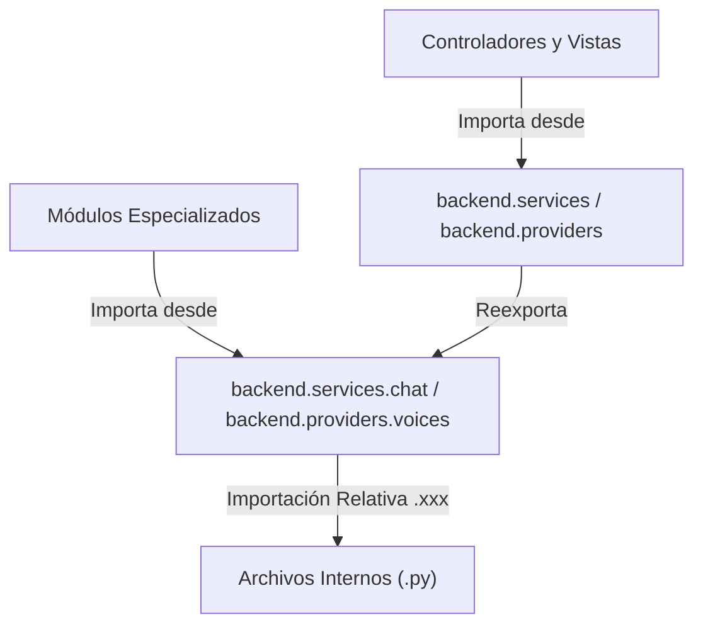

# Walkthrough - WT-1.5.8_06: Arquitectura Two-Tier y Modernización de Fachadas en Backend

**Versión:** `v1.5.8`  
**Documento:** `WT-1.5.8_06.md`  
**Fecha:** 02 de Septiembre, 2026  

---

## 1. Resumen Ejecutivo

Este documento consolida la refactorización arquitectónica profunda de toda la suite `backend/` ([WT-1.5.8_18] al [WT-1.5.8_30]), implementando el patrón de **Fachadas en Dos Niveles (Two-Tier Facade Architecture)**, erradicando importaciones absolutas a rutas de archivos profundos y estandarizando importaciones relativas intra-paquete (`from .xxx import ...`).

---

## 2. Principios del Patrón Two-Tier en Backend

Cada subsistema principal (`services`, `providers`, `database`, `models`, `interfaces`, `workers`, `handlers`, `core`) fue dotado de:
1. **Fachada de Raíz (`backend.<subsystem>`)**: Exporta los símbolos canónicos de consumo general para vistas, controladores y coordinadores.
2. **Fachada de Dominio Específico (`backend.<subsystem>.<domain>`)**: Permite a consumidores especializados acceder a herramientas específicas (ej. `backend.services.chat`, `backend.providers.voices`, `backend.providers.chat`) sin exponer la implementación de bajo nivel de archivos individuales.

---

## 3. Matriz de Subsistemas Modernizados

| Paquete Backend | Archivos Auditados | Estado | Principales Fachadas y Exportaciones |
| :--- | :---: | :---: | :--- |
| **`backend/models`** | 3 | **Certificado** | `AlertEvent`, `AlertConfig`, `ChatMessageDTO`, `CommandDTO`, etc. |
| **`backend/interfaces`** | 4 | **Certificado** | `TokenStorageProtocol`, `AlertStorageProtocol`, `MusicProviderProtocol`, etc. |
| **`backend/database`** | 13 | **Certificado** | `DatabaseManager`, `MusicCacheManager` y los 12 storages SQLite vía imports relativos. |
| **`backend/core`** | 3 | **Certificado** | `AppContainerCore`, `MainWindowCore`, `setup_application_logging`. |
| **`backend/config`** | 4 | **Certificado** | `APP_VERSION`, credenciales OAuth y `DEFAULT_DICTIONARY`. |
| **`backend/controllers`** | 13 | **Certificado** | Los 13 controladores consumiendo `backend.models`, `backend.database` y `backend.services`. |
| **`backend/handlers`** | 4 | **Certificado** | Desacoplados de rutas profundas de workers y modelos. |
| **`backend/workers`** | 10 | **Certificado** | 10 workers Qt (`TwitchRewardWorker`, `KickChatWorker`, etc.) exportados centralizadamente. |
| **`backend/providers`** | 15 | **Certificado** | Proveedores de chat (`Kick`, `Twitch`, `YouTube`, `TikTok`) y voz (`Piper`, `Local`, `Web`). |
| **`backend/services`** | 16 | **Certificado** | 28 servicios exportados (`AlertService`, `ChatService`, `BackupService`, etc.). |

---

## 4. Beneficios Arquitectónicos y de Rendimiento

1. **Information Hiding**: Los archivos internos pueden ser refactorizados, divididos o renombrados sin afectar a ningún consumidor externo.
2. **Rendimiento $\mathcal{O}(1)$ en Resolución de Módulos**: Python resuelve directamente los símbolos a través de las tablas cacheadas en `sys.modules` y las listas explícitas `__all__`, sin recorrer el árbol de archivos en disco.
3. **Cero Dependencias Circulares**: La rigurosa jerarquización de capas previene ciclos de importación entre servicios y proveedores.

---

## 5. Verificación Automatizada

- Carga de módulos verificada programáticamente con `uv run python -c "import backend.services; import backend.providers; import backend.database; print('OK')"`.
- 100% de la suite de pruebas pasando sin regresiones (239 unit tests).
