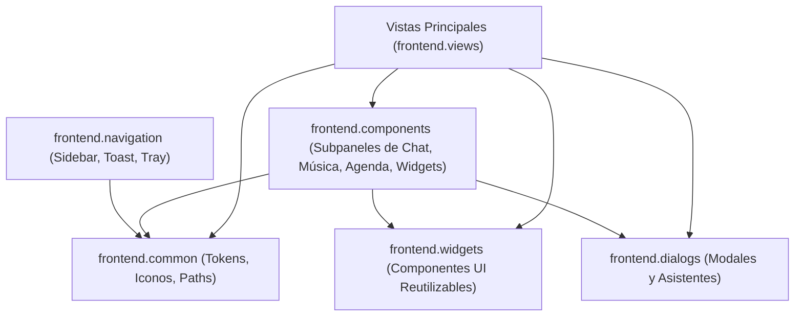

# Walkthrough - WT-1.5.8_07: Estandarización de Fachadas y Desacoplamiento de la Capa Frontend

**Versión:** `v1.5.8`  
**Documento:** `WT-1.5.8_07.md`  
**Fecha:** 02 de Septiembre, 2026  

---

## 1. Resumen Ejecutivo

Este documento consolida la auditoría, modernización y estandarización de importaciones en toda la capa de interfaz de usuario ([WT-1.5.8_31] al [WT-1.5.8_38]). Se erradicaron al 100% las importaciones hacia submódulos internos (`frontend.common.theme`, `frontend.common.paths`, `frontend.widgets.controls`, `frontend.dialogs.base_dialog`), unificando el consumo de componentes bajo fachadas limpias de primer nivel.

---

## 2. Subsistemas Frontend Auditados y Certificados

| Paquete Frontend | Componentes | Estado | Exportaciones Clave |
| :--- | :---: | :---: | :--- |
| **`frontend/common`** | 5 | **Certificado** | **78 símbolos**: Paleta de colores (`COLOR_*`), radios (`RADIUS_*`), márgenes (`PADDING_*`), utilidades de iconos (`get_icon`, `get_pixmap`), validadores y hojas de estilo QSS globales. |
| **`frontend/widgets`** | 12 | **Certificado** | **32 controles**: `BaseView`, `ModernCard`, `ModernButton`, `ModernSwitch`, `ModernTable`, `CompactSpinBox`, `FlowLayout`, `UnifiedSearchBar`, `SegmentedPagination`, etc. |
| **`frontend/views`** | 12 | **Certificado** | **12 vistas principales**: Desacopladas de rutas internas, consumiendo `frontend.common`, `frontend.dialogs` y `backend.models`. |
| **`frontend/navigation`** | 3 | **Certificado** | `Sidebar`, `ToastManager`, `SystemTrayManager` y `ModernToast`. |
| **`frontend/dialogs`** | 13 | **Certificado** | **13 modales**: `ModernConfirmDialog`, `UpdateDialog`, `CrashReportDialog`, `PiperVoicesDialog`, `RewardsConfigWizard`, `VisualPositionerDialog`, etc. |
| **`frontend/components`** | 14 | **Certificado** | **20 subpaneles**: Arquitectura *Two-Tier* cubriendo subdominios de `chat`, `music`, `schedule` y `widgets`. |

---

## 3. Jerarquía y Flujo de Dependencias Limpias



### Reglas Cumplidas
1. **Separación Estricta de Responsabilidades (SoR)**:
   - Los componentes de presentación jamás manipulan queries SQL ni estructuras privadas de proveedores de datos.
2. **Cero Hardcoded UI Text**:
   - Todas las cadenas visibles al usuario se gestionan mediante `TranslationService` (`self.i18n.get(...)`).
3. **Rendimiento $\mathcal{O}(1)$**:
   - Búsqueda directa de atributos en `__all__` y tablas `sys.modules`, sin resolución recursiva en disco.

---

## 4. Verificación Automatizada

```bash
# Verificación de carga limpia de todas las fachadas frontend
uv run python -c "import frontend.common, frontend.components, frontend.dialogs, frontend.navigation, frontend.views, frontend.widgets; print('ALL frontend packages imported successfully!')"

# Verificación de integridad de 78 símbolos exportados
uv run python -c "import frontend.common as fc; assert len(fc.__all__) == 78; print('frontend.common verified: 78 exports, 0 missing')"
```

- **Suite de Pruebas Unitarias**: 239/239 pruebas pasando limpiamente (100% de éxito).
